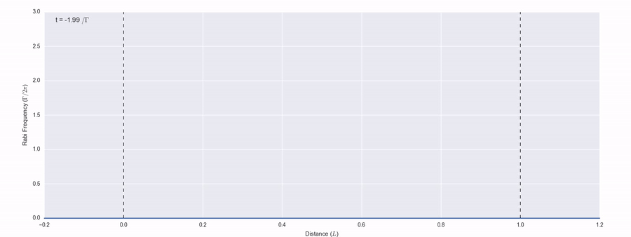

# MaxwellBloch

[](https://travis-ci.org/tpogden/maxwellbloch)
[](https://maxwellbloch.readthedocs.io/en/latest/?badge=latest)
[](https://coveralls.io/github/tpogden/maxwellbloch?branch=master)
[](https://pypi.org/project/MaxwellBloch/)

MaxwellBloch is a Python package for solving the coupled Maxwell-Bloch
equations describing the nonlinear propagation of near-resonant light through
thermal quantised systems such as atomic vapours.



Above is an [example solution][4pi] for the propagation of a 4π pulse through a
dense atomic vapour. The pulse immediately breaks up on entering the medium and
the resultant pulses form two optical solitons each with a pulse
area of 2π.

[4pi]: https://github.com/tpogden/notebooks-maxwellbloch/blob/master/examples/mb-solve-two-sech-4pi.ipynb


## Documentation

Docs for the project are at [maxwellbloch.readthedocs.io][docs].

## Install

I recommend using Conda environments. 

You can create and activate an environment named `mb` with all the required
dependencies for MaxwellBloch with
```sh
conda create --name mb python=3 numpy=1 scipy=1 qutip=4
conda activate mb
```
The MaxwellBloch package can then be installed from
[PyPI](https://pypi.org/project/MaxwellBloch/) using

```
pip install maxwellbloch
```

More detailed installation instructions can be found in the [docs][docs] along with many example problems.

## Changelog

See [CHANGELOG.md](CHANGELOG.md).

## License

MIT License. See [LICENSE.txt](LICENSE.txt).

[docs]: https://maxwellbloch.readthedocs.io/
