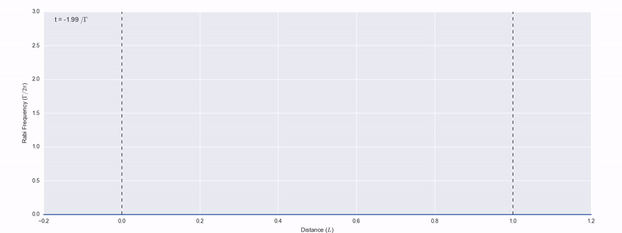

# MaxwellBloch

[](https://github.com/tpogden/maxwellbloch/actions/workflows/ci.yml)
[](https://maxwellbloch.readthedocs.io/en/latest/?badge=latest)
[](https://coveralls.io/github/tpogden/maxwellbloch?branch=master)
[](https://pypi.org/project/MaxwellBloch/)

MaxwellBloch is a Python package for solving the coupled Maxwell-Bloch
equations describing the nonlinear propagation of near-resonant light through
thermal quantised systems such as atomic vapours.



Above is an [example solution][4pi] for the propagation of a 4π pulse through a
dense atomic vapour. The pulse immediately breaks up on entering the medium and
the resultant pulses form two optical solitons each with a pulse
area of 2π.

[4pi]: https://github.com/tpogden/notebooks-maxwellbloch/blob/master/examples/mb-solve-two-sech-4pi.ipynb


## Documentation

Docs for the project are at [maxwellbloch.readthedocs.io][docs].

## Install

The recommended way to install is via [uv](https://docs.astral.sh/uv/):

```sh
uv pip install maxwellbloch
```

Or using pip:

```sh
pip install maxwellbloch
```

If you prefer Conda, you can create and activate an environment with the
required dependencies with
```sh
conda create --name mb -c conda-forge python=3.11 qutip
conda activate mb
pip install maxwellbloch
```

More detailed installation instructions can be found in the [docs][docs] along with many example problems.

## Attribution

If you use MaxwellBloch for research, please use the following citation:
```
@misc{ogden2020maxwellbloch,
  author = {Ogden, Thomas P.},
  title = {{MaxwellBloch}: a Python package for solving the coupled 
    Maxwell-Bloch equations describing the nonlinear propagation of 
    near-resonant light through thermal quantised systems such as atomic 
    vapors.},
  year = {2020},
  publisher = {GitHub},
  journal = {GitHub repository},
  howpublished = {\url{https://github.com/tpogden/maxwellbloch}}
}
```

## Changelog

See [CHANGELOG.md](CHANGELOG.md).

## License

MIT License. See [LICENSE.txt](LICENSE.txt).

[docs]: https://maxwellbloch.readthedocs.io/
